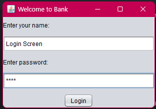
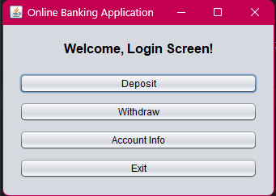
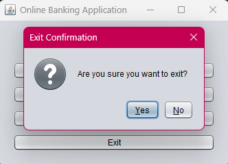

# Simple Bank GUI Application

A basic Java Swing application that simulates simple banking operations with a graphical user interface.  
Features include user login with password verification, deposit, withdrawal, and balance inquiry.

---

## Features

- User login with name and password (`user` is the default password).
- Password input masked for security.
- Login attempt limit: 3 tries before program exit.
- Main menu displaying logged-in user's name.
- Deposit and withdraw money with input validation.
- View account information (account holder and current balance).
- Confirmation prompts on exit.
- Modern look & feel (Nimbus theme).
- Built with Java Swing for straightforward GUI layout and interaction.

---
## Look and Feel

This application uses the **Nimbus Look and Feel**, a modern and visually appealing theme bundled with the Java Runtime Environment. Nimbus provides a clean, elegant UI with smooth gradients, rounded components, and consistent appearance across different platforms, enhancing the user experience without requiring extra dependencies.

If Nimbus is not available, the program gracefully falls back to the default Java Look and Feel.

---

## Data Storage

Currently, all account data (user name, balance) is stored **only in memory (within the JVM)** while the program is running.  
**Once the program exits, all data is lost.**

### Future Plans

- Implement persistent storage using a **text file-based database** or a **real database** (e.g., SQLite or MySQL) to save account and transaction information across sessions.

---

## Screenshots

*(Add screenshots of your login screen, main menu, and dialogs here if desired)*
- Login Screen:

- Main Menu 
- Exit screen 

---

## Getting Started

### Prerequisites

- Java Development Kit (JDK) 8 or above installed.
- An IDE or command-line environment to compile and run Java code.

### Running the Application

1. Compile all `.java` source files:
    ```
    javac Application.java LoginFrame.java MainMenuFrame.java Account.java
    ```
2. Run the application:
    ```
    java Application
    ```
3. Enter your name and the password `"user"` to log in.

---

## Project Structure

- `Application.java` — Main entry point; sets up UI theme and launches login frame.
- `LoginFrame.java` — Login GUI and authentication logic.
- `MainMenuFrame.java` — Main menu GUI with deposit, withdraw, info, and exit options.
- `Account.java` — Business logic for account balance, deposit, and withdrawal.

---

## Future Improvements

- Support multiple users with account data stored in files or databases.
- Add transaction history and statements.
- Enhance UI design with custom themes or JavaFX.
- password hashing for better security.
- Include unit tests for logic validation.

---
